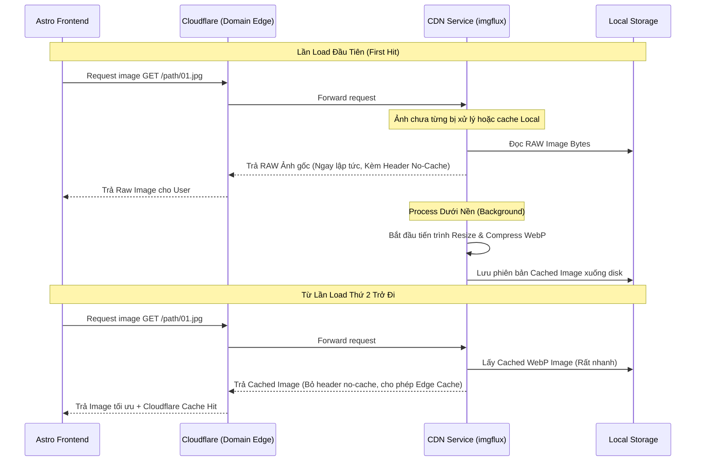

# PRD: Hệ thống CDN & Optimization (imgflux)

## 1. Tóm tắt điều hành
Hệ thống CDN (viết bằng Rust - `imgflux`) đóng vai trò là chiếc van dẫn nước đưa dữ liệu hình ảnh vật lý khổng lồ từ ổ đĩa máy chủ (nằm trong thư mục `storage/commics/...` do Crawler tải về) đến tận tay thiết bị Frontend của người dùng cuối. 
Core Value của hệ thống này là Caching (Lưu trữ đệm) và Dynamic Resizing nhằm hỗ trợ Frontend đạt chuẩn tối ưu Web Vitals (SEO).

## 2. Sơ đồ Cấu trúc Cung ứng Hình Ảnh (Image Serving Flow)

## 3. Đặc tả Luồng Hình ảnh (Optimization Strategy)

Như Owner quy định, để phục vụ người đọc truyện ngay lập tức, `imgflux` không được phép block request chờ nén hình. Chiến thuật xử lý động (Dynamic Processing Workflow) như sau:

### 3.1. Progressive First-Load Fallback (Trả Raw, Nén Sau)
- Khi có request đầu tiên tới một ảnh mới do Crawler đem về, Service `imgflux` chưa có bộ nhớ đệm đã nén trên Disk cho ảnh này. Việc tốn CPU nén sẽ kéo dài hàng trăm MS.
- **Tiêu chuẩn**: Trả về trực tiếp (Fallback) mảng bytes hình ảnh Gốc (Raw Image) ra cho Client.
- **Header Control**: Mẻ Request đầu tiên này phải gắn kèm HTTP Response Header chặn Cache (No-cache/No-store) để trình duyệt và đặc biệt là Cloudflare **không được** lưu lại bản nặng này.
- **Thundering Herd Protection**: Cùng 1 lúc có thể có hàng trăm users request 1 hình ảnh chưa được cache, nếu thả lỏng có thể sập CPU server do chạy hàm nén hàng loạt. Phải dùng khóa **Atomic File Lock/Redis Lock** tại Background Thread. Chỉ Request đầu tiên trigger việc nén sinh WebP. Các request sau nếu thấy trạng thái `is_processing` thì chủ động trả mảng RAW bytes tiếp mà quyết không gọi Compressor Thread.
- **Validate Bytes (Corruption handler)**: Trước khi compress phải có bước chạy Magic byte header/File Signature checker. Nếu ảnh file gốc là 0 bytes hoặc corrupt, set trạng thái ảnh là `uncompressible` vĩnh viễn (chỉ trả file ảnh gốc). Bỏ qua hoàn toàn Compress task cho request sau để tránh crash loop engine.

### 3.2. Cached-Hit Mode (Secondary Requests)
- Bắt đầu từ Request thứ hai, `imgflux` quét Disk và nhặt ngay bộ ảnh đã được nén tối ưu.
- Lần này, HTTP Server sẽ strip bỏ (gỡ đi) header "no-cache", ném lại cho Frontend đi qua Cloudflare.
- **Cloudflare Edge Cache**: Sau giai đoạn Deploy lên domain, Cloudflare sẽ ôm phiên bản ảnh đã tối ưu này vào bộ Edge Server của Node mạng toàn cầu, chia lửa hoàn toàn cho server Core.

## 4. Giao tiếp Dữ liệu với Frontend và API
- **Input Storage**: Thư mục mồi (Root path) neo vào cấu trúc thư mục mà hệ thống Crawler (PRD-020) đã định nghĩa. Ví dụ: `storage/commics/comic-id/chapter/chapter-id`.
- Dữ liệu link ảnh Frontend gửi lên hoàn toàn là URL bóc tách từ Array JSONB của bảng Chapter PostgreSQL.

## 5. Ánh xạ Yêu cầu Từ Frontend (Astro Needs)
- **Thumbnails/Bìa truyện**: Frontend yêu cầu CDN phục vụ cover ở tỷ lệ đúng chuẩn `2:3` để nhét vừa Grid Trang Chủ bằng CSS Object Fit. Không được bóp méo khung.
- **Long-strip Reader**: Với các dạng truyện Webtoon dài, các đường rìa biên phân mảnh của hình ảnh được nén trả về từ CDN Không Được Phép (Must not) có lỗi "nhiễu artifacts". Tức là khi nối cuộn dọc 2 bức ảnh không được sinh ra đường kẻ sọc trắng do thuật toán nén WebP gọt sai biên.

---
**PIC Skill**: `cloudflare-workers-expert`
**Owner**: DevNguyen
