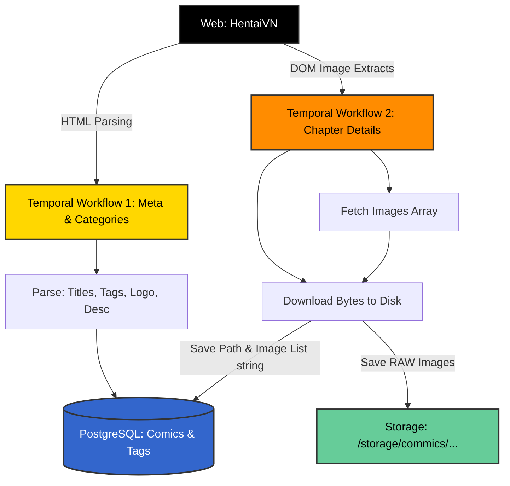

# PRD: Hệ thống Crawler (Comic Engine)

## 1. Tóm tắt điều hành
Hệ thống Crawler là trái tim thu thập dữ liệu tự động của dự án Commics. Hệ thống sử dụng **Temporal (Python SDK)** để điều phối quy trình phân tích HTML và tải ảnh (raw), bắt đầu với nguồn mục tiêu rễ là `hentaivn.ch`.

Điểm mấu chốt của Crawler này là không chỉ thu thập URL, mà phải tải thực tế ảnh về thư mục cục bộ (Disk Storage) và thiết lập cơ sở dữ liệu mapping chính xác từ Crawler -> Database -> CDN để phục vụ Frontend.

## 2. Mục tiêu Cơ bản (Core Objectives)
- **Metadata Khắt khe**: Cào toàn diện không chỉ ID, Title, Chapter mà bắt buộc phải lấy `Logo`, `Banner`, `Icon`, `Thumbnail` (nếu có), `Description`, `Author`.
- **Phân biệt Thể loại (Categories)**: Thu thập, bóc tách và chuẩn hóa Category Tag để gán vĩnh viễn vào Database giúp Frontend filter.
- **Bảo toàn Order Logic**: Đảm bảo thuật toán sinh `order_index` chuẩn xác từ lúc thu thập, bất chấp cấu trúc xáo trộn của nguồn, tạo tiền đề cho API order dễ dàng.
- **Độ tin cậy cao (Reliability)**: Chống chết dở dang bằng khả năng tự lưu state và retry của Temporal.

---

## 3. Kiến trúc Luồng Xử lý (Architecture Diagram)

Sơ đồ Mermaid dưới đây biểu diễn luồng đi của Temporal Crawler từ lúc đọc target web cho đến khi đổ file xuống Disk và ghi đường dẫn vào Postgres.

## 4. Đặc tả Workflow (Temporal Workflows)

> **Quyết định thiết kế**: Giữ nguyên kiến trúc **Temporal + Python** thay vì cấu trúc message queue nhẹ như BullMQ vì Temporal duy trì Memory State của luồng cào lâu dài (Long-running process), tự động khôi phục Activity nếu rớt mạng, phù hợp tuyệt đối cho logic Crawl chặn/đợi (Sleep & Retry) hàng ngàn ảnh.

### 4.1. Workflow 1: Comic Listing & Metadata
- **Nhiệm vụ**: Quét chi tiết một truyện cụ thể.
- **Input**: Có thể nhận tham số là `source_url` (Link web gốc) hoặc `source_id` (ID của web gốc). Đây là thiết kế cho phép chạy workflow với Truyện Chưa Có Trong Database.
- **Quy trình xử lý đối với truyện Mới (Not in DB)**:
  1. Crawler tiến hành request trang và nhổ toàn bộ Thông tin (Title, Tags, Ảnh đại diện...).
  2. Validate với Database thông qua `source_url` (Unique Constraint).
     - Nếu **CHƯA TỒN TẠI**: Tiến hành lệnh `INSERT` để tạo mới bản ghi Comic và lấy về tự động Internal `comic_id` của Database ta.
     - Nếu **ĐÃ TỒN TẠI**: Thực hiện lệnh `UPDATE` (Upsert logic).
  3. Lấy chính Internal `comic_id` từ Database sinh ra ở bước trên truyền sang cho Input của **Workflow 2**.
- **Output Schema**:
  - Tạo thành công bản ghi Comic bao gồm: `comic_id` (Internal DB), `slug`, `title`, `author`, `description`, `status`.
  - Gán danh sách Array objects `categories`.
  - Tải và lưu các ảnh tĩnh: `logo_path`, `banner_path`, `thumbnail_path`.

### 4.2. Workflow 2: Chapter Details & Assets
- **Nhiệm vụ**: Lấy toàn bộ image links của 1 chapter, bắt đầu tải xuống, và tính toán số thứ tự chương.
- **Tiêu chí Đánh giá Thành công (Metrics Evals)**:
  - Một chapter được đánh dấu là **Crawled (Thành công)** CHỈ CẦN tải được có ảnh, và mảng `url_imgs` được update đầy đủ vào thông tin Crawler của chương đó, KHÔNG BẮT BUỘC phải chờ 100% tất cả ảnh download xong không lỗi hỏng.
- **Data Mapping Requirement (Database - CDN)**:
  - Khi lưu, Crawler chèn 1 bản ghi vào bảng Chapter với đường dẫn `img_path` (vd: `storage/commics/123/chapter/1/`) và mảng JSON tên file (`["01.jpg", "02.jpg"]`). Hệ thống CDN sau này sẽ lấy `img_path` làm rễ (root) để truy xuất dữ liệu từ Disk.

## 5. Xử lý Sự cố & Dự phòng (Fault Tolerance & Bypass)

Vì target (hentaivn) có các cơ chế ngăn chặn crawler (Anti-bot), các Activity giao tiếp HTTP bắt buộc phải cấu hình:
1. **Header Manipulation**: Tráo đổi luân phiên (Rotate) `User-Agent` profile thành các trình duyệt Chrome/Safari thực tế. Khóa chặn header `Referer` chuẩn.
2. **Network Bypass**: Khai báo và định tuyến toàn bộ Traffic thông qua proxy (SOCKS5/HTTP Proxy) để tránh việc bị ban IP Server khi tần suất fetch cao.
3. **Cloudflare Block / Timeout**: Thông qua Retry Policy mặc định của Temporal, nếu request bị timeout hoặc nhận proxy block 403/503, tự động back-off (ngủ) 10s-30s và thử lại với proxy profile khác.
4. **Data Duplication (Upsert)**: Để chống trùng lặp dữ liệu khi Crawler chạy lại vô tình, câu lệnh Insert xuống Database bắt buộc dùng logic **Upsert** (`ON CONFLICT (source_url) DO UPDATE`). 
5. **Storage Path Immutable**: Thư mục lưu trữ Disk không được phép dùng `slug` (vì slug web nguồn có thể đổi). Bắt buộc dùng Numeric ID nội bộ hoặc UUID để khóa cứng thư mục. (Ví dụ: `/storage/commics/<numeric-id>/chapter/x/`).

## 6. Logic Thứ tự Chương (Order Validation)
Thuật toán cấp thiết ngay trong Workflow 2.
- **Input**: Nhận về danh sách String bất kỳ từ DOM thẻ A: "Oneshot", "Chap 3", "2.1", "Phiên ngoại".
- **Execution**: Activity phải regex lấy Numeric index nếu có. Nếu list DOM trả về 100 chương bị lộn xộn, Crawler phải tự dò list đó để cấp một tham số FLOAT/INT tuyệt đối tên là `order_index` tăng dần. (Ví dụ Oneshot = 1.0, Chap 2.1 = 2.1).
- Mọi logic Sort/OrderBy của API cho UI sau này CHỈ ĐƯỢC PHÉP ăn theo `order_index` này.

---
**PIC Skill**: `playwright-skill` hoặc/và Python Temporal
**Owner**: DevNguyen
