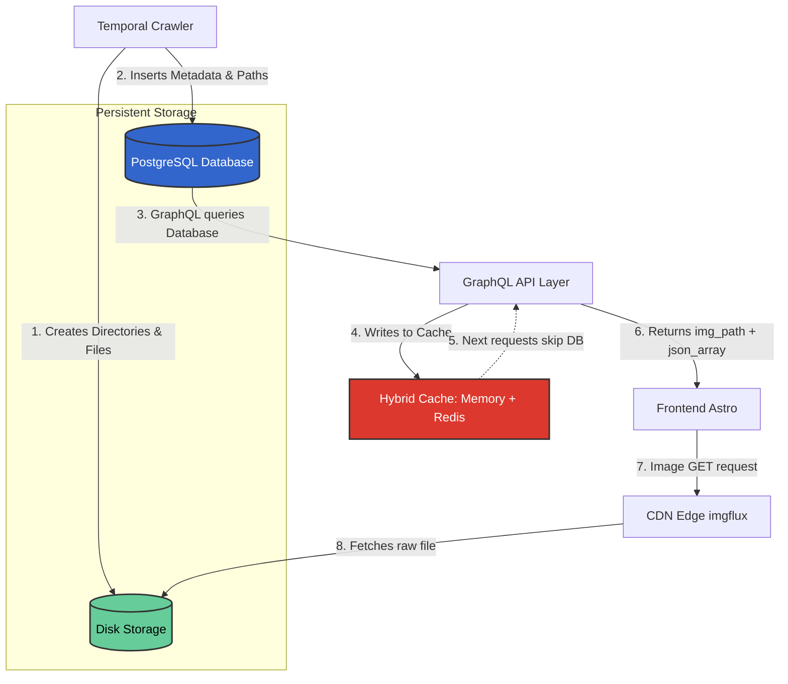

# PRD: Hệ thống Database (Persistence Layer)

## 1. Tóm tắt điều hành
Lớp Persistence Layer (PostgreSQL) chịu trách nhiệm lưu trữ cấu trúc Dữ liệu gốc thu thập từ Crawler (gồm Schema Truyện, Metadata chương, Categories, Worker Status). 

Đặc biệt, Database ở dự án này không chỉ lưu văn bản mà còn gánh trọng trách **Mapping Layer** cực kỳ quan trọng giữa (A) File vật lý trên Disk do Crawler tạo ra với (B) URL mà Frontend & CDN sẽ sử dụng để render. Cache Layer (Redis) được bọc lên trên PostgreSQL để đảm bảo API GraphQL truy xuất siêu tốc phục vụ Frontend.

---

## 2. Sơ đồ Kiến trúc Lưu trữ (Storage & Mapping Architecture)

## 3. Thực thể chính (Major Entities)

> Về thiết kế Database, chúng ta tuân thủ nguyên tắc: **Server DB chỉ lưu trữ thông tin được crawl về và làm pointer truy xuất.** Hệ thống DB không được dùng để lưu trữ User Tracking (Reading History / Bookmarks) do những tính năng đó đã được giao thầu 100% cho Frontend LocalStorage Browser. Cấu trúc bảng tuân thủ Spec `Spec-Database.md` sử dụng Diesel Migration.

### 3.1. Comic (Truyện) & Thể Loại
- Thông tin tĩnh bao gồm: `id`, `slug`, `title`, `author`, `description`, `status`.
- Hình ảnh đại diện (Meta-images): `logo_path`, `banner_path`, `thumbnail_path`. (Những path này dẫn vào thư mục CDN).
- Categories (Thể loại): Ràng buộc Many-To-Many. Dữ liệu mồi (Seed Data) sẽ băm đủ 10+ tag chính dựa trên phân tích HentaiVN (Webtoon, NTR, Cheating, Family, Mông to,...).

### 3.2. Chapter (Chương & Hình ảnh)
Đây là Entity cốt lõi phản ánh mối tương quan (Correlation) giữa Crawler và CDN.
- **`chapter_number` (String)**: Lưu giá trị thô Crawler thấy (Chap 1, Oneshot).
- **`order_index` (Float)**: Tham số tuyệt đối dùng cho logic GraphQL `ORDER BY`.
- **`storage_path` (String)**: Điểm neo quan trọng nhất chứa Local Path tới ổ đĩa cứng. VD: `/storage/commics/<id>/chapter/<chap-id>/`. Nơi hệ thống CDN sẽ vào lấy file RAW.
- **`images` (JSONB Array)**: Một dải các chuỗi chứa thông tin file ảnh VÀ kích thước. Cấu trúc JSONB Array phải bao gồm Object Dimension để thiết lập Frontend CLS = 0 (Ví dụ: `[{"file": "001.jpg", "w": 800, "h": 1200}]`). Frontend căn cứ vào JSON này để reserve `
` trống trước khi ảnh tải xong.

### 3.3. Worker Tracking (Quản lý tiến trình Crawler)
Được nhúng trực tiếp vào Entity Comic (Dạng các cột prefix `worker_`):
- `worker_status`, `worker_last_run`, `worker_error_log`.
- **Atomic Requirement**: Hành động Crawler update trạng thái Worker này phải diễn ra cùng trong **1 SQL Transaction (Atomic Commit)** với hành động Insert array của Chapter để phòng tránh lệch pha dữ liệu khi Crash ngang.

### 3.4. Ràng buộc Dữ liệu (Constraints)
- Đảm bảo tính toán toàn vẹn bằng cách cấu hình **Unique Constraint** trên `(comic_id, chapter_number)` và `source_url` để Frontend không xuất hiện 2 chapter trùng khi crawler chạy đè.

## 4. Chiến lược Chịu Tải & Cache

### 4.1. Server/Scaling Strategy
- Hiện tại, vì số lượng Data và User đang ở Phase 1 nên **cấu trúc PostgreSQL là cấu trúc đơn Node (Monolithic Database).**
- Yêu cầu về Partitioning (Phân mảnh bảng Chapter lớn) hay Primary/Replica Replication là **Chưa cần thiết**. Toàn bộ cấu trúc sẽ ưu tiên Index Query (`slug`, `comic_id`, `order_index`).
- Migration Policy áp dụng tự động qua Diesel Migration. Zero-downtime migration **Chưa cần thiết** ở phase này.

### 4.2. Strategy: Hybrid Cache (Memory + Redis)
Theo hướng dẫn kiến trúc của Owner, GraphQL API không trỏ thẳng vào Postgres mỗi Request. Nó dựa vào một hệ thống Hybrid:
- **Tầng 1 (Memory Cache)**: Các truy vấn rất nóng và nhẹ (Như Top 10 danh sách truyện, hoặc categories tag tĩnh) được ôm vào bộ nhớ In-Memory cục bộ của Rust. Ngũ nghỉ nhanh (Short TTL) tránh Leak Memory.
- **Tầng 2 (Redis)**: Sử dụng Redis cấu hình cơ bản (Drop Redis Cluster phức tạp) để cache nội dung các Query Chapter/Comic Detail, hạn chế Database I/O Overhead khi Frontend Astro call SSG/SSR build trang.

---
**PIC Skill**: `postgresql`
**Owner**: DevNguyen
