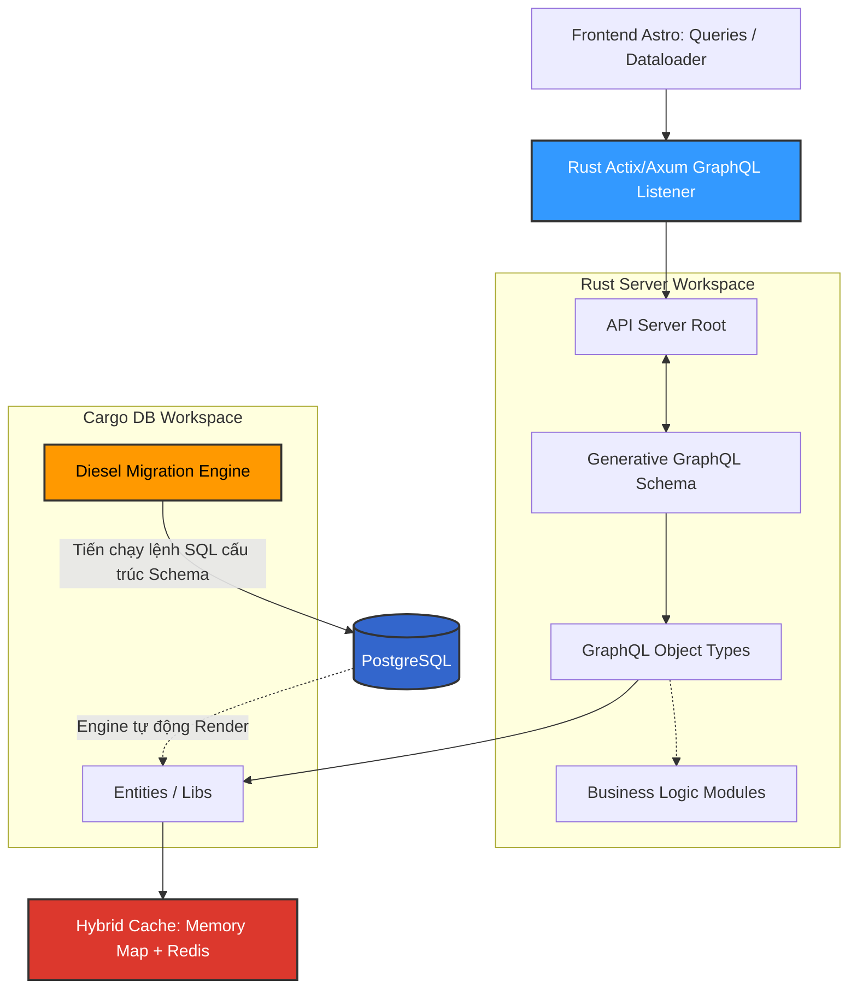

# PRD: Hệ thống GraphQL API Layer

## 1. Tóm tắt điều hành
API Aggregator (GraphQL Layer) là cầu nối bảo chứng (Gatekeeper) cung cấp dữ liệu phục vụ render SEO tĩnh lẫn Lazy load động cho Frontend. Hệ thống bắt buộc xây dựng bằng **Rust**, kế thừa y hệt thiết kế folder architecture của source codebase mẫu (`api-aggregator-serving`), đảm bảo độ ổn định Production.

## 2. Kiến trúc Tham chiếu & File Topology (Reference Architecture)

Cần đặc biệt lưu ý về tính Rập khuôn theo kiến trúc có sẵn. Quá trình phát triển sẽ tái sử dụng lại `db/src` structure (entity, libs) và core router của `server/src/main.rs`. Các module thư viện dependency như khai báo TOML sẽ không nâng cấp version mạo hiểm mà tuân thủ đúng ver từ template (chỉ lược bỏ các Installer Tool dôi dư không liên quan đến việc chạy GraphQL Server).

## 3. Đặc tả Nhiệm vụ Lõi (Core Requirements)

### 3.1. Diesel Workflow & Scheme Generator
- Đặc tính khắt khe của DB Schema đối với Rust App: Hệ thống Data và Model đã hình thành và có data đổ từ khâu Crawler (PRD-020).
- Trách nhiệm của layer này là cấu hình và Impl lại Migrations (tương đương kiến trúc ERD PRD-021 Database) bằng Diesel-rs.
- KHÔNG TỰ VIẾT CODE thủ công file `schema.rs`. Toàn bộ file này phải được **Generated** thông qua quá trình chạy Diesel Migrations.
- GraphQL Type và Queries sẽ map ngược mapping từ kết quả models rust tự gen này.

### 3.2. Caching Strategy: Tối giản Cluster
Theo yêu cầu thiết kế mới, cắt bỏ cấu hình Redis Cluster phức tạp nguyên bản của Source Mẫu do Overhead cao.
Sử dụng **Hybrid Cache Architecture**:
- Tầng 1: **Memory Cache (LRU Crate Rust)**. Khác với thiết kế HashMap bình thường dễ gặp Memory Leak, Tầng 1 bắt buộc sử dụng Least Recently Used (LRU) Cache có giới hạn capacity ví dụ: 5000 items. Thu hồi nhanh (Short TTL). Ưu điểm: Bypass hoàn toàn Netwok Round-Trip.
- Tầng 2: **Redis Standalone**. Khớp nhả truy cập cho các phân mảng Chapter Content Data đồ sộ. 

### 3.3. Tối ưu N+1 & Pagination Scaling
- **Dataloader**: Mọi resolvers query danh mục lồng nhau (1 truyện -> n danh mục) phải được xử lý qua `async-graphql-dataloader` batching. Tránh tình trạng server dính chưởng ngàn lượt query nhỏ nhặt trên Postgres làm sập Pool.
- **Cursor-based Pagination**: Do đặc thù bảng Comic và Chapters sẽ phình to ra hàng triệu record, việc thiết kế API Pagination bằng `LIMIT/OFFSET` sẽ biến thành Full Table Scan siêu chậm lảng phí RAM. Vì vậy, các Pagination List API bắt buộc sử dụng chuẩn Cursor (Lấy `id` hoặc `order_index` làm ranh giới).

### 3.4. Logic Trì hoãn (Deferred Business Functions)
Các Logic về Tương tác người dùng dư thừa (Lưu History, Bookmarks db backend) hoặc Logic Security Cấp độ Vĩ mô (Query Depth Complexity Rate Limiting, Authentication Authorization chống Cào) tạm thời Đóng Băng và thả vào nhóm tính năng "Mở rộng Tương lai" (Future Scope). 

## 4. API Queries Phục vụ Bắt buộc cho Astro Vitals
GraphQL Resolver phải thiết kế thuận tiện hỗ trợ Layout Astro đắp mặt tiền (UI Facade):
- Trả về tham số tĩnh hỗ trợ việc Pagination: Limit, Offset cursor, Total Docs.
- Trả Metadata Breadcrumbs đắp sẵn lên SEO Page.
- GraphQL Data cho danh sách Image trong Chapter chỉ móc từ JSONB Schema trong Db sang mà không nhúng Logic Convert tính toán.

---
**PIC Skill**: `graphql-architect`
**Owner**: DevNguyen
