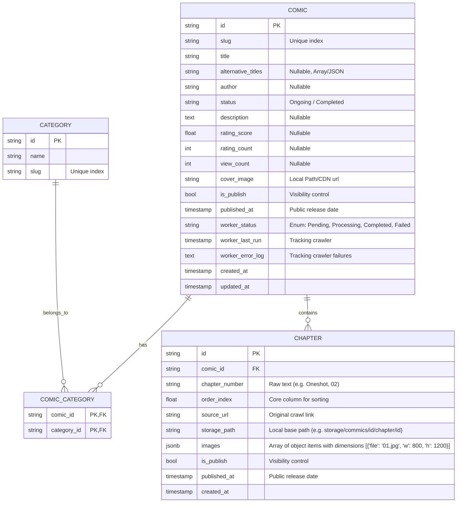

# Spec: Hệ thống Database (Persistence Layer)

Tài liệu này chi tiết hóa kiến trúc và luồng dữ liệu của hệ thống Database, chuyên trị lưu trữ dữ liệu nghiệp vụ của dự án Commics, bao gồm thông tin truyện, chương và quản lý worker tracking.

## 1. Hiện trạng & Yêu cầu (Current State & Requirements)

### 1.1. Cấu trúc dữ liệu

Hệ thống kết hợp PostgreSQL cho dữ liệu quan hệ và Redis cho lớp đệm (Cache) để tối ưu hóa hiệu năng và khả năng truy xuất.

Dựa trên việc phân tích trang truyện mục tiêu thực tế (HentaiVN) và yêu cầu tích hợp giải pháp CDN/Image Optimization (`imgflux`), các trường dữ liệu được mở rộng nhằm đáp ứng nhu cầu lưu trữ đầy đủ metadata và đường dẫn vật lý của tài nguyên.

| Phân hệ             | Yêu cầu thu thập                                       | Trạng thái  | Ghi chú                                   |
| :------------------ | :----------------------------------------------------- | :---------- | :---------------------------------------- |
| **Comic Info**      | id, slug, title, alt_titles, author, status, description, views, rating, cover_image | ⚠️ Pending   | Mở rộng thêm rating, view, alt titles      |
| **Categories**      | id, name, slug                                         | ✅ Active    | Chuẩn hóa thành bảng riêng, quan hệ Many-to-Many |
| **Chapter Info**    | id, comic_id, chapter_number, order_index, source_url, storage_path, images | ✅ Active    | Bổ sung array `images` & `storage_path` để map CDN |
| **Worker Tracking** | worker_status, worker_last_run, worker_error_log       | ✅ Active    | Đã tách ra các bảng `worker_comics`, `worker_chapters` |

### 1.2. Sơ đồ Thực thể Liên kết (ERD)

Dưới đây là sơ đồ thiết kế sơ bộ ERD của hệ thống CSDL chính, tối ưu cho Crawler và tích hợp CDN serving qua GraphQL.

### 1.3. Khoảng trống dữ liệu nhận diện từ Survey & Roadmap

Dựa vào phân tích từ `Deep-Survey-Data.md`, `Roadmap.md` và các PRDs:
- Dữ liệu mồi (Seed Data) cho `Categories` cần khởi tạo ngay lập tức 10 tag chính được quét (NTR, Cheating, Gia đình, Webtoon,...).
- Cột `chapter_number` phải hỗ trợ đa định dạng văn bản thô (Oneshot, Chap 02, Ch. 1) mà không làm vỡ kiến trúc DB.
- **Tích hợp CDN (`imgflux`)**: Database cần đóng vai trò là Mapping Layer. Crawler khi kéo ảnh về disk (`storage_path`) sẽ cắm danh sách chính xác các tên file theo đúng thứ tự mảng JSON vào cột `images`. FE thông qua GraphQL API sẽ nhận được mảng này và tự động nối với domain của CDN service để fetch đúng ảnh, tránh việc GraphQL API phải thực hiện thao tác I/O đọc thư mục mỗi lần request.

---

## 2. Giải pháp Kỹ thuật (Proposed Solution)

### 2.1. Thiết kế Schema (PostgreSQL)

Chúng ta tách biệt luồng dữ liệu nghiệp vụ và dữ liệu hệ thống tracking để đảm bảo hiệu suất truy vấn Reader tốt nhất.

1. **Bảng `comics`** vs **Bảng `chapters`**:
   - Sử dụng Index trên các cột `slug` của bảng `comics` và `comic_id`, `order_index` của bảng `chapters` để phục vụ Frontend truy vấn cực nhanh (độ trễ < 50ms).
   
2. **Quản lý Worker (Metadata Layer)**:
   - Thay vì tạo bảng rời, tích hợp trực tiếp prefix `worker_` vào bảng `comics` (`worker_status`, `worker_last_run`, `worker_error_log`). 
   - Điều này giúp Workflow Temporal 1 và 2 dễ dàng check trạng thái update mà không cần `JOIN` phức tạp.
   - **Atomic Requirement**: Mọi lệnh cập nhật tracking (`worker_status`) và Insert Chapter Array phải được gom chung vào **1 khối SQL Transaction** nguyên tử. Tránh lỗi insert chapter xong mà crash khiến status lơ lửng.

3. **Image & CDN Mapping (`CHAPTER.images`)**:
   - Biến `images` được cấu trúc dưới dạng JSONB lưu Array Object. Ví dụ: `[{"file": "001.jpg", "w": 800, "h": 1200}]`. Khi API GraphQL query chapter data, mảng này được đẩy thẳng xuống Frontend. Thiết kế kèm Width/Height là bắt buộc để Frontend có thể chống CLS (Gật khung hình). Cấu trúc này siêu nhẹ, decoupled với storage layer.

4. **Ràng buộc Dữ liệu (Constraints)**:
   - Tạo **Unique Constraint** trên bộ đôi `(comic_id, chapter_number)` và cột `source_url` để chống Crawler lặp nội dung.

### 2.2. Kiến trúc Cache (Redis)

- **Metadata Truyện**: Cache toàn bộ cấu trúc bảng `comics` với TTL dài (24h). Invalidate khi Crawler cập nhật mới.
- **Chapter Renders**: Lấy danh sách link json `images` và `storage_path` từ Postgres và nhét thẳng vào Redis JSON. Khi user chuyển tới chapter mới, GraphQL kéo trực tiếp từ Redis trong <10ms.

## 3. Phân tích Kiến trúc Component (DevNguyen's Insight)

Một vấn đề kỹ thuật lớn là: **Xử lý Ordering Chương truyện linh hoạt không bị lộn xộn?**

### 3.1. Vấn đề của Number/Float

Việc lưu `Chap 1`, `Chương 02` thành ID tăng dần theo Autoincrement sẽ hỏng nếu Crawler thu thập ngược thứ tự (Ví dụ: Crawler lấy chap 10 trước chap 1).

### 3.2. Giải pháp Order Index
- **`chapter_number` (String)**: Giữ nguyên văn bản thô để UI render.
- **`order_index` (Integer/Float)**: Cột lõi (Core Column) do Crawler hoặc DB Trigger tự tính nội suy. Mọi truy vấn GraphQL khi liệt kê danh sách chương phải chạy theo `ORDER BY order_index ASC/DESC`.

> [!TIP]
> **Kết luận**: Việc uỷ quyền quá trình "sắp xếp logic" vào một cột riêng biệt `order_index` giúp chia rẽ rõ ràng giữa **Mặt hiển thị (Display)** và **Mặt logic Toán học (Sort Engine)**, tạo ra Frontend GraphQL API cực kỳ dẻo dai.

---

## 4. Kiến nghị triển khai

- Sử dụng **Diesel Migration (Rust)** để auto-generate Schema và thực hiện Migration tự động đảm bảo tính đồng nhất với Code. Không dùng Prisma/TypeORM ở layer này.
- Cấu hình Cache theo chuẩn Hybrid (LRU Memory + Redis) thay vì Redis thuần. Memory xài LRU Capacity để chống tràn RAM.
- Áp dụng Bulk Insert khi Crawler insert Chapter (hàng ngàn records/giây) để chống quá tải Transaction.

## Tham chiếu
- [[020-Requirements/PRD-Database]]
- [[020-Requirements/PRD-Crawler]]
- [[020-Requirements/PRD-CDN]]
- [[010-Planning/Roadmap]]
