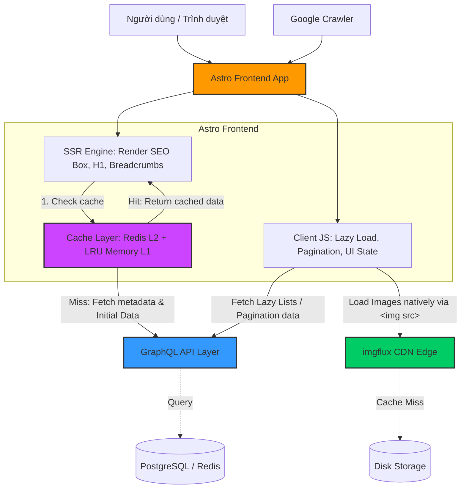

---

# Spec: Giao diện Người dùng (Astro Frontend)

Tài liệu này vạch ra giải pháp công nghệ đáp ứng bài toán về Tốc độ (Performance), Tìm kiếm (SEO Engine) và Trải nghiệm đọc (Reader UX) đỉnh cao theo kiến trúc "Island Architecture" của Astro.

## 1. Hiện trạng & Yêu cầu Bố cục (Layout Requirements)

Hệ thống Frontend cần tải cực nhanh (SSG/SSR) đối với các nội dung SEO, đồng thời xử lý hành vi người dùng bằng Javascript động cho chức năng lazy-load.

### 1.1. Ba loại màn hình chính
Đặc tả chi tiết 3 bố cục trang cốt lõi của ứng dụng:

1. **Trang Danh sách (List Pages)**:
   - *Bao gồm*: Trang Chủ (Home), Trang Danh sách theo Thể loại (Category Tag Pages), Trang Kết quả tìm kiếm.
   - *Bố cục*: Grid hiển thị thẻ truyện (thumbnail, tên, rating, số chapter). 
   - *Chức năng*: **Phân trang (Pagination)** bắt buộc phải có để xử lý số lượng truyện lớn. Dữ liệu danh sách có thể lazy-load.
   
2. **Trang Chi tiết Truyện (Comic Detail Page)**:
   - *Bố cục*: 
     - Thông tin chi tiết truyện (Bìa, Tên, Tác giả, Description, Status, Rating). Đây là nội dung quan trọng nhất cho SEO.
     - Danh sách chương (Chapter list) có thể scroll/pagination nếu quá dài.
     - Danh sách truyện đề xuất (Recommended / Có thể bạn sẽ thích).
     
3. **Trang Đọc Truyện (Chapter Reading Page)**:
   - *Bố cục*: Luồng cuộn dọc (Long strip) chứa danh sách hình ảnh của truyện.
   - *Điều hướng*: Thanh công cụ (Floating Navbar) trượt ẩn/hiện chứa các link: Next Chapter, Previous Chapter, Cuộn lên đầu trang (Top), Cuộn xuống cuối trang (Bottom).

### 1.2. Mở rộng Hệ thống Điều hướng & SEO
- **Breadcrumbs**: Bắt buộc có cấu trúc Breadcrumbs rõ ràng (VD: `Trang chủ > Thể loại > Tên truyện > Chapter 1`) để người dùng dễ định vị và Google Bot hiểu cấu trúc site.
- **Tiêu chuẩn SEO Khắt khe**:
  - Chỉ duy nhất **1 thẻ H1** trên mỗi trang, chứa từ khóa SEO trọng tâm (Tên truyện ở trang chi tiết, Tên danh mục ở trang Category).
  - Tối ưu SSR (Server-Side Rendering) cho các vùng nội dung cần SEO (Box thông tin truyện, Tên truyện, Tags, Text description).
  - Lazy load cho các dữ liệu API như danh sách truyện đề xuất hoặc mảng hình ảnh. Nếu chưa tải được hình, JS vẫn render trước thuộc tính `alt` chứa từ khóa mô tả để bot đọc được nội dung ảnh.
  - **Canonical Tags**: Phải trỏ đúng URL gốc để tránh duplicate content.
  - **Sitemap & Robots**: Sitemap được chia thành **nhiều file** (sitemap-index, sitemap-page, sitemap-categories, sitemap-comics, sitemap-chapters) để bao phủ toàn bộ URL động từ DB. File `robots.txt` trỏ đến `sitemap-index.xml`.

---

## 2. Sơ đồ Kiến trúc Kết nối (Architecture Diagram)

Dưới đây là sơ đồ Mermaid thể hiện bức tranh toàn cảnh kết nối giữa Frontend, CDN và hệ thống API:



---

## 3. Giải pháp Kỹ thuật (Proposed Solution)

### 3.1. Framework Lõi: Astro.build
Đem lại lợi thế cạnh tranh tuyệt đối khi đấu trường làm nội dung comic cần SEO bứt phá.
- **Partial Hydration (Astro Islands)**: Đa số giao diện text HTML, box thông tin SEO sẽ được server xuất ra toàn bộ dạng tĩnh (SSR) không kèm 1 byte mảng JS.
- Mạch tương tác (Như Client-side Routing, Button Next/Prev, Modal Reader, Pagination) được load JS qua directive `client:idle` hoặc `client:visible`.

### 3.2. Cấu trúc Routing & Canonical
- Dynamic Routes của Astro sẽ tự động inject thể `<link rel="canonical" href="..."/>` khớp với request path.
- Sitemap integration: Sử dụng `@astrojs/sitemap` để build sitemap động mỗi khi có route truyện mới.

### 3.3. Động cực đại hoá hình ảnh (Alt-Text Strategy & CLS = 0)
- **Ảnh Bìa (Cover Image)**: Từ GraphQL, `coverImage` trả về path thô. Ở Frontend, Adapter bọc qua helper `getImageUrl(path)` để nối chuỗi tiền tố CDN cục bộ (VD: `/cdn-cgi/image/original/`).
- **Ảnh Chương (Reader Images)**: Backend GQL resolver (`images` list trong `Chapter`) trả về `storage_path` thô. Frontend map cái `storage_path` đó qua `getImageUrl(path)` để browser gọi lên container CDN.
- **Biến Môi Trường (Runtime)**: `PUBLIC_CDN_URL` được truy xuất qua `getRuntimeEnv` để đảm bảo tính động trong môi trường Docker, cho phép thay đổi CDN mà không cần rebuild bundle frontend.
- **Tránh nhảy trang (Cumulative Layout Shift = 0)**: Dữ liệu API GraphQL cho mảng Chapter Images truyền vào phải là Array Objects chứa Image Dimensions (`[{"file": "x", "w": 800, "h": 1200}]`). Component Frontend Astro dựa vào size đó Render sẵn thẻ Box placeholder `<div style="aspect-ratio">` chống sụp khung trước khi ảnh thực từ CDN chạy về.
- **Lazy Loading & SSR Performance**: Quá trình SSR chỉ render thẻ `` với thuộc tính `src` đã được chuẩn hoá. Browser sẽ tự động tải ảnh bất đồng bộ sau khi nhận HTML. Quá trình này **không** block SSR response, giúp page load nhanh ngay từ cái nhìn đầu tiên. Đối với các hình ảnh chapter nằm sâu bên dưới, sử dụng `loading="lazy"` để tối ưu.

### 3.4. Quản lý Tracking Trạng thái (Browser Only)
- Khách tự lưu bookmark và History thông qua `LocalStorage`. Hoàn toàn cấm Network POST Tracking Call chọc vào GraphQL Layer (Stateless). 
- **Chống Tràn Quota**: Vì LocalStorage cực bé (~5MB), bắt buộc Component Sync Storage phải áp dụng cấu trúc **Eviction Slice**: Mảng History/Bookmark chốt tối đa 500 Object. Vượt ngưỡng sẽ tự Pop() đuôi để thoát lỗi `QuotaExceededError`.

### 3.5. SSR Cache Layer

Để giảm tải GraphQL và tăng tốc SSR, mọi API call từ server-side Astro đều đi qua cache layer.

- **Driver**: `ioredis` + `lru-cache` — Redis L2 (persistent) + LRU Memory L1 (per-process)
- **Pattern**: `withCache(fn, { mode, ttl, tags })` — Higher-Order Function bọc ngoài các API function
- **Mode**: `stale-while-revalidate` — Trả về data cũ ngay, refresh ngầm sau TTL
- **Flight Dedupe**: Nhiều request đồng thời cùng key → chỉ 1 lần gọi GraphQL
- **Tag Invalidation**: `revalidateTag('comics')` xóa cache ngay khi crawler thêm data mới

| API Function | TTL Fresh | Mode |
|---|---|---|
| `getCategories()` | 1 giờ | SWR |
| `getComics()` | 5 phút | SWR |
| `getComic(slug)` | 10 phút | SWR |
| `getChapter(id)` | 30 phút | SWR |

**Files**:
- `src/lib/cache/redis.ts` — ioredis singleton
- `src/lib/cache/driver.ts` — CacheDriver (get/set/del/tags), prefix `commics:`
- `src/lib/cache/index.ts` — `cacheFetch` + `withCache` HOC + `revalidateTag`
- `src/lib/api/commics/index.ts` — wrap tất cả API functions với `withCache`

### 3.6. Chiến lược Sitemap (Multi-Sitemap Structure)

Vì Astro chạy `output: 'server'` (SSR), `@astrojs/sitemap` mặc định **không** tự sinh URL cho dynamic routes. Giải pháp là tạo custom sitemap endpoints query từ GraphQL (qua cache).

```
sitemap-index.xml
  ├── sitemap-page.xml         # Trang tĩnh: /, /truyen-hot, /tim-kiem, /the-loai
  ├── sitemap-categories.xml   # /the-loai/[slug] — từ getCategories()
  ├── sitemap-comics.xml       # /[slug] — từ getComics()
  └── sitemap-chapters.xml     # /[slug]/[chapterId] — từ comics.chapters[]
```

**Auto-update khi crawl thêm data**:
- **Tự nhiên**: TTL SWR hết hạn → data mới từ GraphQL được lấy tự động
- **Tức thì**: Crawler gọi `POST /api/revalidate` (Bearer token) → `revalidateTag(['comics'])` → cache bị xóa ngay
- **HTTP**: `Cache-Control: public, max-age=3600` trên sitemap response → Google re-fetch đúng lịch

**Files**:
- `src/pages/sitemap-index.xml.ts`
- `src/pages/sitemap-page.xml.ts`
- `src/pages/sitemap-categories.xml.ts`
- `src/pages/sitemap-comics.xml.ts`
- `src/pages/sitemap-chapters.xml.ts`
- `src/pages/api/revalidate.ts` — Webhook invalidate cache
- `public/robots.txt` — trỏ đến `sitemap-index.xml`

---

## 4. Phân tích Kiến trúc Component (DevNguyen's Insight)

Một vấn đề cần giải quyết triệt để: **Memory Leak & Trải nghiệm lướt chương siêu dài**.

### 4.1. Content-Visibility và Intersection Observer
- Astro Layout tại Page Reader kết hợp logic gắn CSS Property thuần tuý `content-visibility: auto` kích hoạt ảo hoá (Virtualization) trên Browser. Những dải vùng ảnh nằm ngoài màn hình chưa tới kịp sẽ không bị Engine Browser tập trung xử lý.
- Floating Navbar UI: Các nút điều hướng (Next/Prev/Top/Bottom) sẽ được gắn trong Navbar thông minh. Kéo xuống (Scroll down) -> `transform: translateY(-100%)` trượt giấu đi, kéo lên (Scroll up) -> Hiện lại. Cực kì mượt mà nhờ Passive Event Listener.

---

## 5. Kiến nghị triển khai

- **Tailwind CSS Strategy**: Viết class Tailwind ngay trong thẻ markup của Astro file.
- **Pre-Fetching Caching**: API gọi từ GraphQL cho các dữ liệu lazy (như list truyện) được cache chuẩn trên client (VD: SWR) để thao tác Pagination không bị khựng sượng.

## Tham chiếu
- [[020-Requirements/PRD-Frontend]]
- [[030-Specs/Spec-GraphQL]]
- [[030-Specs/Spec-CDN]]
