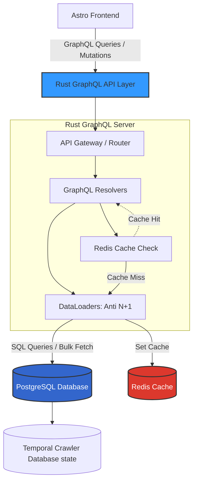

# Spec: Hệ thống GraphQL API Layer

Tài liệu này chi tiết hóa kiến trúc xử lý của hệ thống API GraphQL (viết bằng Rust) đóng vai trò cổng kết nối duy nhất giữa Frontend và Backend, cung cấp khả năng đa truy vấn với tốc độ xử lý hàng loạt, đáp ứng chặt chẽ các yêu cầu render tĩnh (SSR) và động (Lazy-load) của Frontend.

## 1. Hiện trạng & Yêu cầu Hỗ trợ Frontend

Hệ thống được thiết kế để chịu tải lớn và trả về đúng định dạng dữ liệu (Schema) phục vụ triệt để các bố cục và chiến lược SEO của Frontend Astro.

### 1.1. Mục tiêu Tương thích với 3 Màn hình chính
API Layer cần cung cấp các Queries riêng biệt tối ưu cho từng loại màn hình:
1. **Trang Danh sách (List Pages)**:
   - Hỗ trợ tham số **Phân trang (Pagination)** chuẩn (VD: offset/limit hoặc cursor-based) để UI có thể lazy-load load more / chuyển trang.
   - Hỗ trợ filter/sort linh hoạt (Trending, Latest, theo Category).
2. **Trang Chi tiết Truyện (Comic Detail)**:
   - Cung cấp dữ liệu Metadata đầy đủ (để FE render SSR SEO Box).
   - Truy vấn lồng (Nested query) trả về **Breadcrumbs path** tĩnh (Ví dụ: `[{ id, name, type }]`).
   - Cung cấp danh sách `related_comics` (Truyện recommend).
3. **Trang Đọc Truyện (Chapter Page)**:
   - Truy vấn lấy danh bạ mảng tên file `images` và `storage_path` nhẹ bén nhất.
   - Cung cấp data liên kết điều hướng: `next_chapter_id` và `prev_chapter_id` cho thanh công cụ Reader.

---

## 2. Sơ đồ Kiến trúc Kết nối (Architecture Diagram)

Sơ đồ Mermaid dưới đây mô tả sự tương tác của tầng GraphQL với CSDL và vai trò cung cấp dữ liệu cho Frontend:

---

## 3. Giải pháp Kỹ thuật (Proposed Solution)

### 3.1. Rust GraphQL Framework (Juniper / Async-graphql)
Sử dụng source mẫu sẵn có, tinh gọn lại các modules thừa và tập trung vào `async-graphql`. 

1. **Resolver Tối ưu (Chống N+1)**:
   - Sử dụng kĩ thuật DataLoader (Dataloader Pattern) để gom batch các truy vấn. Khi FE query danh sách truyện ở Home + Pagination kèm theo Tags/Categories, API không bị dính N+1 call xuống DB.
   
2. **Hỗ trợ SEO và Breadcrumbs**:
   - Viết các Query riêng trả về cây danh mục tĩnh để Frontend gọi ở phase SSR build breadcrumbs. Thông qua một call GraphQL, FE nhận đủ data để đắp vào `<title>`, `<h1>`, và meta tags.

### 3.2. Server-side Ordering & Navigation
Bắt buộc Rust GraphQL API phải nhận trách nhiệm Sort và tính toán Navigation thay thế Client.
- **Order Indexing**: API trích dán parameter `order_by` thẳng vào truy vấn Postgres `ORDER BY order_index ASC`. Tránh tình trạng Client tự sort mảng khổng lồ gây crash RAM.
- **Next/Prev Resolver**: Trong chapter query, API tự động look-up chapter có `order_index` kề cạnh để gắn vào field `next_chapter` và `prev_chapter`. Frontend chỉ việc bốc route ID quăng vào thẻ `<a>`.

### 3.3. Lớp Caching Tích hợp (Tối Ưu Hybrid)
Bỏ qua mô hình Redis Cluster truyền thống có overhead cao, áp dụng kiến trúc **Hybrid Cache (Memory Map + Redis Standalone)**:
- **Tầng 1 (LRU Cache Rust)**: Dùng cho các list Query Hot, tĩnh, size nhỏ (Categories, Top 10 Comic). Phải gài chuẩn Crate **Least Recently Used (LRU)** Limit Size (Ví dụ 5.000 records đổ lại) thay vì HashMap thô. Nhanh TTL, Ngăn triệt để rò rỉ RAM OOM.
- **Tầng 2 (Redis Standalone)**: Dùng cho các Query Data khổng lồ hoặc List Chapters lấy từ DB và Dataloader trả lên. Mọi request cho Chapter Images (mảng ảnh đọc chap) sẽ ping vô Redis:
   - Nếu Redis Hit -> Trả ngay dạng Vector Object Array `[{"file":"x", "w":1, "h":1}]` trong < 5ms.
   - Frontend nhận mảng WebP tự động Render giao diện.

### 3.4. Ràng Ngoại Cấu Trúc (Diesel Auto-gen)
- Schema DB Map trong Rust Server được bảo mật bằng Diesel. Source gốc `api-aggregator/db` file `schema.rs` phải do Rust Migration Auto-generate, **tuyệt đối Code System không viết nối tay** dễ gây lệch pha Model Map lúc Query Database.

---

## 4. Kiến nghị triển khai

- **GraphQL Schema Definition**: Xây dựng Schema file-based (`schema.graphql`) cung cấp Connection types hỗ trợ chuẩn Relay Pagination/Cursor-based nếu danh sách truyện quá lớn. Bỏ qua hoàn toàn chiến lược Offset/Limit dễ sập băng thông (Full-Scan DB). Bắt buộc Cursor List API.
- **Connection Pool**: Sử dụng `bb8` hoặc `deadpool` cho Postgres/Redis trong Rust để giữ Pool luôn Warm, đảm bảo Time-To-First-Byte (TTFB) siêu thấp cho khâu SSR của Frontend.

## Tham chiếu
- [[020-Requirements/PRD-GraphQL]]
- [[030-Specs/Spec-Frontend]]
- [[030-Specs/Spec-Database]]
