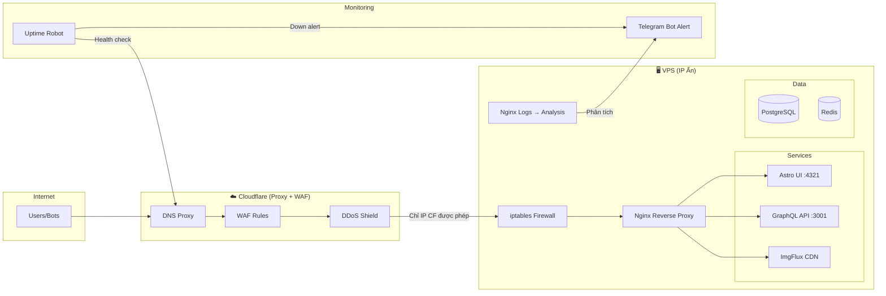
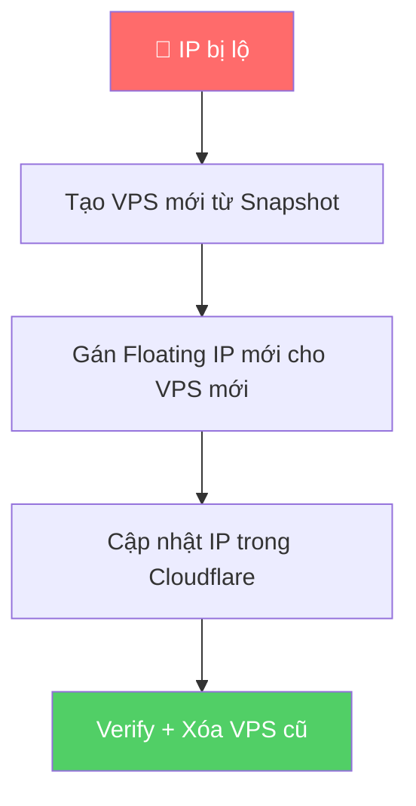
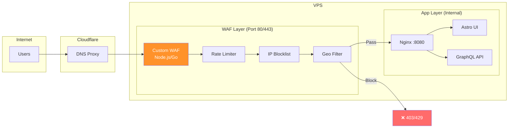
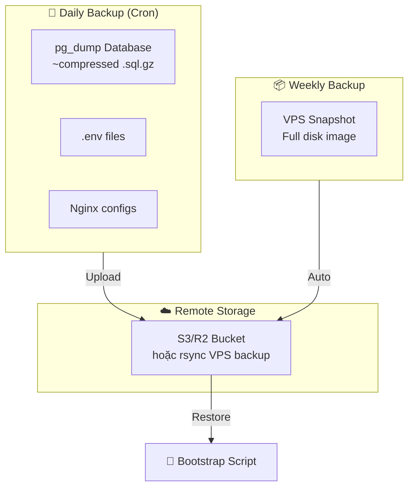

# Requirement: Security & System Architecture

> **Date**: 2026-03-03  
> **Purpose**: Nghiên cứu và đề xuất giải pháp hạ tầng bảo mật cho production deployment  
> **Status**: Draft — Research & Proposal

---

## Mục Lục

1. [Ẩn IP gốc VPS qua Cloudflare](#1-ẩn-ip-gốc-vps-qua-cloudflare)
2. [Thay đổi IP nhanh khi bị lộ](#2-thay-đổi-ip-nhanh-khi-bị-lộ)
3. [Chống DDoS — Cloudflare vs Custom WAF](#3-chống-ddos--cloudflare-vs-custom-waf)
4. [Backup & Bootstrap Strategy](#4-backup--bootstrap-strategy)
5. [Uptime Monitoring + Telegram Alert](#5-uptime-monitoring--telegram-alert)
6. [Nginx Logging & IP Analysis](#6-nginx-logging--ip-analysis)

---

## Kiến Trúc Tổng Quan



---

## 1. Ẩn IP Gốc VPS Qua Cloudflare

### Mục tiêu
- IP thật của VPS **không bao giờ lộ ra ngoài**
- Mọi traffic đều đi qua Cloudflare proxy
- Không ai quét được service trực tiếp trên IP VPS

### Giải Pháp

#### 1.1 Cloudflare DNS Proxy (Orange Cloud ☁️)

```
Domain: example.com
A Record: @ → VPS_IP  (Proxy: ON ☁️)
CNAME: www → example.com (Proxy: ON ☁️)
```

> [!CAUTION]
> **PHẢI bật Proxy (Orange Cloud)** cho TẤT CẢ DNS records. Nếu set "DNS Only" (Grey Cloud), IP thật sẽ lộ qua DNS lookup.

#### 1.2 Firewall VPS — Chỉ Cho Phép IP Cloudflare

Tạo script `setup-firewall.sh`:

```bash
#!/bin/bash
# === CHỈ CHO PHÉP CLOUDFLARE IP TRUY CẬP PORT 80/443 ===

# Reset rules
iptables -F
iptables -X

# Allow loopback
iptables -A INPUT -i lo -j ACCEPT

# Allow established connections
iptables -A INPUT -m state --state ESTABLISHED,RELATED -j ACCEPT

# Allow SSH (từ IP quản trị cụ thể)
iptables -A INPUT -p tcp --dport 22 -s YOUR_ADMIN_IP -j ACCEPT

# Cloudflare IPv4 ranges (cập nhật từ https://cloudflare.com/ips-v4)
for ip in \
    173.245.48.0/20 \
    103.21.244.0/22 \
    103.22.200.0/22 \
    103.31.4.0/22 \
    141.101.64.0/18 \
    108.162.192.0/18 \
    190.93.240.0/20 \
    188.114.96.0/20 \
    197.234.240.0/22 \
    198.41.128.0/17 \
    162.158.0.0/15 \
    104.16.0.0/13 \
    104.24.0.0/14 \
    172.64.0.0/13 \
    131.0.72.0/22; do
    iptables -A INPUT -p tcp -s "$ip" --dport 80 -j ACCEPT
    iptables -A INPUT -p tcp -s "$ip" --dport 443 -j ACCEPT
done

# DROP tất cả traffic khác đến port 80/443
iptables -A INPUT -p tcp --dport 80 -j DROP
iptables -A INPUT -p tcp --dport 443 -j DROP

# Save rules
iptables-save > /etc/iptables/rules.v4
echo "✅ Firewall configured — only Cloudflare IPs allowed"
```

#### 1.3 Checklist Chống Lộ IP

| Check | Mô tả | Cách kiểm tra |
|-------|--------|---------------|
| ✅ DNS Proxy ON | Tất cả records bật Orange Cloud | Cloudflare Dashboard |
| ✅ Firewall rules | Chỉ CF IPs truy cập 80/443 | `iptables -L -n` |
| ✅ Không gửi email từ VPS | Email header lộ IP | Dùng service ngoài (SendGrid) |
| ✅ Không dùng FTP | FTP banner lộ IP | Dùng SFTP qua SSH |
| ✅ Không expose service khác | Scan port thấy service | `nmap -p- domain.com` |
| ✅ SSL Mode Full (Strict) | Tránh MITM | CF Dashboard → SSL |

---

## 2. Thay Đổi IP Nhanh Khi Bị Lộ

### Mục tiêu
- Thay IP VPS **trong vòng 5-10 phút**
- **Zero downtime** hoặc downtime tối thiểu

### Giải Pháp: Floating IP + Snapshot



#### 2.1 Phương án A: Floating IP (Khuyến nghị)

**Providers hỗ trợ**: DigitalOcean, Hetzner, Vultr, Linode

| Step | Action | Thời gian |
|------|--------|-----------|
| 1 | Tạo snapshot VPS hiện tại | 2-5 phút |
| 2 | Tạo VPS mới từ snapshot | 1-2 phút |
| 3 | Reassign Floating IP sang VPS mới | < 30 giây |
| 4 | Cập nhật Cloudflare DNS (nếu không dùng Floating IP) | < 1 phút |
| 5 | Xóa VPS cũ | Tức thì |
| **Tổng** | | **~5-10 phút** |

```bash
# Ví dụ với Hetzner CLI
# 1. Snapshot
hcloud server create-image --type=snapshot my-server

# 2. Tạo VPS mới từ snapshot
hcloud server create --image=snapshot-xxx --type=cx21 --name=new-server

# 3. Gán Floating IP
hcloud floating-ip assign FLOATING_IP_ID new-server

# 4. Xóa cũ
hcloud server delete my-server
```

#### 2.2 Phương án B: Cloudflare Load Balancer (Premium)

- Config 2+ origin servers trong CF Load Balancer
- Khi IP lộ → disable origin cũ, enable origin mới
- **Zero downtime** nhưng tốn thêm chi phí CF ($5-20/month)

#### 2.3 Phương án C: Script Tự Động

Tạo script `emergency-ip-change.sh`:

```bash
#!/bin/bash
# Emergency IP rotation script
NEW_VPS_IP="$1"
CF_ZONE_ID="your_zone_id"
CF_API_TOKEN="your_api_token"
RECORD_ID="your_a_record_id"

# Update Cloudflare DNS
curl -X PUT "https://api.cloudflare.com/client/v4/zones/$CF_ZONE_ID/dns_records/$RECORD_ID" \
  -H "Authorization: Bearer $CF_API_TOKEN" \
  -H "Content-Type: application/json" \
  --data '{
    "type": "A",
    "name": "@",
    "content": "'$NEW_VPS_IP'",
    "ttl": 1,
    "proxied": true
  }'

echo "✅ DNS updated to $NEW_VPS_IP"
```

---

## 3. Chống DDoS — Cloudflare vs Custom WAF

### 3.1 Phương Án A: Cloudflare (Free + Pro)

| Tính năng | Free | Pro ($20/mo) |
|-----------|------|--------------|
| DDoS Protection L3/L4 | ✅ | ✅ |
| DDoS Protection L7 | Basic | Advanced |
| WAF Rules | 5 rules | Managed Rulesets |
| Rate Limiting | 1 rule | 10 rules |
| Bot Protection | Basic | Advanced |
| Under Attack Mode | ✅ | ✅ |
| Custom Page Rules | 3 | 20 |

**Khuyến nghị**: Free tier đủ cho hầu hết trường hợp. Bật **Under Attack Mode** khi bị DDoS.

#### Config Cloudflare Free:

```
Settings:
  SSL: Full (Strict)
  Always Use HTTPS: ON
  Min TLS: 1.2
  Auto Minify: JS, CSS, HTML
  
Firewall Rules (5 rules):
  1. Block known bad bots (User-Agent contains "bot" + not known crawlers)
  2. Challenge requests > 30/min from same IP
  3. Block specific countries (nếu cần)
  4. Allow known good bots (Google, Bing)
  5. Challenge all requests to /api/* (nếu bị abuse)
```

### 3.2 Phương Án B: Custom WAF (Viết Thêm)

**Khi nào cần**: Khi cần logic phức tạp mà CF Free không cover, hoặc muốn kiểm soát hoàn toàn.

#### Kiến Trúc Triển Khai



#### WAF Placement Options

| Option | Mô tả | Ưu/Nhược |
|--------|--------|----------|
| **A. WAF trước Nginx** | WAF lắng nghe port 80/443, proxy pass đến Nginx internal | ✅ Full control, ❌ Phức tạp |
| **B. Nginx module** | Dùng `ngx_http_limit_req` + `ngx_http_geo` | ✅ Đơn giản, ❌ Giới hạn |
| **C. Sidecar container** | WAF container + Nginx container trong Docker | ✅ Isolate, ❌ Overhead |

**Khuyến nghị**: Option B (Nginx module) cho đơn giản, kết hợp CF:

```nginx
# nginx.conf — Rate limiting + Geo blocking

# Rate limiting zone
limit_req_zone $binary_remote_addr zone=general:10m rate=30r/m;
limit_req_zone $binary_remote_addr zone=api:10m rate=10r/m;

# Geo blocking (nếu cần)
# geo $blocked_country {
#     default 0;
#     # Block specific ranges
# }

server {
    listen 80;
    server_name example.com;
    
    # Real IP from Cloudflare
    set_real_ip_from 173.245.48.0/20;
    set_real_ip_from 103.21.244.0/22;
    set_real_ip_from 103.22.200.0/22;
    set_real_ip_from 103.31.4.0/22;
    set_real_ip_from 141.101.64.0/18;
    set_real_ip_from 108.162.192.0/18;
    set_real_ip_from 190.93.240.0/20;
    set_real_ip_from 188.114.96.0/20;
    set_real_ip_from 197.234.240.0/22;
    set_real_ip_from 198.41.128.0/17;
    set_real_ip_from 162.158.0.0/15;
    set_real_ip_from 104.16.0.0/13;
    set_real_ip_from 104.24.0.0/14;
    set_real_ip_from 172.64.0.0/13;
    set_real_ip_from 131.0.72.0/22;
    real_ip_header CF-Connecting-IP;
    
    # Rate limit
    location / {
        limit_req zone=general burst=20 nodelay;
        proxy_pass http://localhost:4321;
    }
    
    location /api/ {
        limit_req zone=api burst=5 nodelay;
        proxy_pass http://localhost:3001;
    }
}
```

### 3.3 Khuyến Nghị Kết Hợp

```
Cloudflare Free (Layer 1) → Nginx Rate Limit (Layer 2) → Application
```

- CF xử lý DDoS L3/L4 + Bot basic
- Nginx xử lý rate limiting per-IP + security headers
- Application-level: không cần lo DDoS

### 3.4 Bảo Mật Dịch Vụ Cốt Lõi (GraphQL & Docker)

> [!WARNING]
> **Điểm mù bảo mật Docker vs Iptables**: 
> Khi sử dụng Docker publish port (VD: `ports: ["80:80"]`), Docker sẽ tự động thao tác vào chain `DOCKER` của iptables và **vượt mặt (bypass)** hoàn toàn cấm đoán từ firewall (ufw/iptables) mà chúng ta thiết lập ở trên. IP chặn ở INPUT vẫn có thể truy cập thẳng vào port của Container.

**1. Bảo Mật Cổng Docker**
- **Giải quyết**: Tránh publish port public nếu nó là internal. Các Service (`graphql`, `ui`) không được bind ra `0.0.0.0:port` mà chỉ nên bind vào `127.0.0.1:port` hoặc để Nginx (chạy trên Host) proxy thẳng qua Gateway IP của Docker network. Chẳng hạn: `127.0.0.1:3001:3001`.

**2. Tối Ưu GraphQL API Security**
Bảo vệ tầng Network là chưa đủ để chống lại Layer 7 DDoS đánh trực diện vào cấu trúc API. Đối với GraphQL mở, kẻ tấn công có thể lợi dụng đệ quy (nested queries) làm kiệt quệ Postgres và CPU.
- **Tắt Introspection Query**: Vô hiệu hóa Introspection trên production để chặn kẻ tấn công export nội dung GraphQL Schema.
- **Query Depth Limiting**: Chặn các câu truy vấn có độ sâu lồng nhau (VD: Giới hạn độ sâu ở mức `depth = 5`).
- **Query Complexity (Cost Calculation)**: Ràng buộc "điểm số" cho lượng dữ liệu truy vấn để chặn fetch hàng chục ngàn row qua 1 request. (Trong `async-graphql` dùng `.extension(Complexity::new(MAX_COST))`).

### 3.5 Cloudflare Edge Computing (Tùy Chọn Nâng Cao)

Dựa theo khuyến nghị của `@cloudflare-workers-expert`:
- **Edge Security Headers**: Thay vì thiết lập Header (CSP, X-Frame-Options, STS) ở Nginx, ta có thể triển khai **Cloudflare Transform Rules** (hoặc **Cloudflare Workers**) để đính kèm Response Header từ biên. Điều này loại bỏ gánh nặng routing cho VPS, cấu hình ở 1 nền tảng duy nhất và chặn luôn nguy cơ cấu hình sai ở layer app.
- **Edge Rate Limiting & JWT Validation**: WAF có thể được mở rộng bằng Workers để kiểm tra API keys, Auth Tokens, chặn các request ngay từ Edge trước khi nó kịp truyền tải TCP về máy chủ gốc.

---

## 4. Backup & Bootstrap Strategy

### Mục tiêu
- Backup **nhẹ nhất** có thể
- Khôi phục **nhanh nhất** — có thể chạy 1 script bootstrap

### 4.1 Chiến Lược Backup



#### Những gì CẦN backup:

| Data | Size dự kiến | Method | Frequency |
|------|-------------|--------|-----------|
| PostgreSQL dump | ~50-500MB | `pg_dump --compress=9` | Daily |
| Redis RDB | ~1-10MB | `redis-cli BGSAVE` | Daily |
| `.env` files | ~1KB | Copy | On change |
| Nginx configs | ~5KB | Copy | On change |
| Docker Compose files | ~5KB | Git (đã có) | Git tracked |
| Media/Images cache | Bỏ qua — CDN regenerate | — | — |

> [!TIP]
> **KHÔNG cần backup**: Docker images (rebuild từ registry), node_modules (npm install), image cache (CDN tự rebuild).

#### Daily Backup Script: `backup.sh`

```bash
#!/bin/bash
set -euo pipefail

BACKUP_DIR="/backup/$(date +%Y%m%d)"
REMOTE="s3://your-bucket/backups/"
RETENTION_DAYS=30

mkdir -p "$BACKUP_DIR"

# 1. PostgreSQL
docker exec postgres pg_dump -U commics -Fc commics_db \
  | gzip > "$BACKUP_DIR/db.sql.gz"

# 2. Redis
docker exec redis redis-cli BGSAVE
sleep 2
cp /var/lib/redis/dump.rdb "$BACKUP_DIR/redis.rdb"

# 3. Config files
tar czf "$BACKUP_DIR/configs.tar.gz" \
  /opt/commics/.env* \
  /opt/commics/ops/docker/ \
  /etc/nginx/conf.d/

# 4. Upload to remote
aws s3 sync "$BACKUP_DIR" "$REMOTE$(date +%Y%m%d)/" --storage-class STANDARD_IA

# 5. Cleanup old local backups
find /backup -maxdepth 1 -mtime +$RETENTION_DAYS -exec rm -rf {} +

echo "✅ Backup completed: $BACKUP_DIR"
```

#### Cron:
```
# Daily 3AM
0 3 * * * /opt/commics/ops/backup.sh >> /var/log/backup.log 2>&1
```

### 4.2 Bootstrap Script: `bootstrap.sh`

Script khởi tạo lại toàn bộ hệ thống từ backup:

```bash
#!/bin/bash
set -euo pipefail

BACKUP_DATE="${1:-latest}"
REMOTE="s3://your-bucket/backups/"

echo "🚀 Bootstrap from backup: $BACKUP_DATE"

# 1. Install dependencies
apt update && apt install -y docker.io docker-compose-plugin nginx

# 2. Clone repo
git clone https://your-repo.git /opt/commics
cd /opt/commics

# 3. Download backup
aws s3 sync "$REMOTE$BACKUP_DATE/" /tmp/restore/

# 4. Restore configs
tar xzf /tmp/restore/configs.tar.gz -C /

# 5. Start infrastructure
docker compose up -d postgres redis

# Wait for DB ready
sleep 10

# 6. Restore database
gunzip -c /tmp/restore/db.sql.gz | \
  docker exec -i postgres pg_restore -U commics -d commics_db

# 7. Restore Redis
docker cp /tmp/restore/redis.rdb redis:/data/dump.rdb
docker restart redis

# 8. Start application services
docker compose up -d

# 9. Setup nginx + SSL
cp ops/nginx/*.conf /etc/nginx/conf.d/
certbot --nginx -d example.com
systemctl restart nginx

# 10. Setup firewall
bash ops/setup-firewall.sh

# 11. Setup cron
crontab ops/crontab

echo "✅ Bootstrap complete!"
echo "📋 Verify: curl https://example.com"
```

### 4.3 Thử Nghiệm Restore

> [!IMPORTANT]
> **MỖI THÁNG** nên test restore trên VPS test để đảm bảo backup hoạt động.

---

## 5. Uptime Monitoring + Telegram Alert

### 5.1 Phương án: UptimeRobot (Free) + Telegram Bot

**UptimeRobot Free tier**: 50 monitors, check mỗi 5 phút.

#### Monitors cần tạo:

| Service | URL/Endpoint | Type | Interval |
|---------|-------------|------|----------|
| Frontend | `https://example.com` | HTTP(s) | 5 min |
| GraphQL API | `https://example.com/api/health` | HTTP(s) | 5 min |
| CDN/Images | `https://cdn.example.com/health` | HTTP(s) | 5 min |
| SSL Certificate | `https://example.com` | SSL expiry | Daily |

#### Setup Telegram Alert:

```
1. Tạo Telegram Bot:
   → Chat với @BotFather
   → /newbot → đặt tên "CommicsUptimeBot"
   → Lưu TOKEN

2. Lấy Chat ID:
   → Gửi message cho bot
   → GET https://api.telegram.org/bot<TOKEN>/getUpdates
   → Lấy chat.id

3. Config UptimeRobot:
   → My Settings → Alert Contacts
   → Add → Telegram
   → Paste Bot Token + Chat ID
```

### 5.2 Self-hosted Alternative: `uptime-kuma`

Nếu muốn tự host (miễn phí hoàn toàn, nhiều tùy chỉnh hơn):

```yaml
# Thêm vào docker-compose.yml
uptime-kuma:
  image: louislam/uptime-kuma:latest
  restart: unless-stopped
  ports:
    - '3100:3001'
  volumes:
    - ./tmp/uptime-kuma:/app/data
```

- Dashboard web đẹp
- Alert qua Telegram, Discord, Slack, Email
- Check mỗi 20 giây (nhanh hơn UptimeRobot Free)
- Hỗ trợ TCP, HTTP, DNS, Docker, Push monitors

### 5.3 Custom Script Alert (Nhẹ nhất)

```bash
#!/bin/bash
# uptime-check.sh — chạy bằng cron mỗi 1 phút
TELEGRAM_TOKEN="your_bot_token"
CHAT_ID="your_chat_id"
SERVICES=(
  "https://example.com|Frontend"
  "https://example.com/api/health|GraphQL API"
  "https://cdn.example.com/health|CDN"
)

for svc in "${SERVICES[@]}"; do
  URL="${svc%%|*}"
  NAME="${svc##*|}"
  
  HTTP_CODE=$(curl -s -o /dev/null -w "%{http_code}" --max-time 10 "$URL")
  
  if [ "$HTTP_CODE" != "200" ]; then
    MSG="🚨 *DOWN* — $NAME%0AURL: $URL%0AStatus: $HTTP_CODE%0ATime: $(date)"
    curl -s -X POST "https://api.telegram.org/bot$TELEGRAM_TOKEN/sendMessage" \
      -d "chat_id=$CHAT_ID&text=$MSG&parse_mode=Markdown"
  fi
done
```

```
# Cron: mỗi phút
* * * * * /opt/commics/ops/uptime-check.sh
```

---

## 6. Nginx Logging & IP Analysis

### Mục tiêu
- Log **tất cả** request qua Nginx
- Ghi lại **Real IP** (từ Cloudflare CF-Connecting-IP)
- Dễ phân tích khi bị DDoS

### 6.1 Nginx Log Format

```nginx
# /etc/nginx/nginx.conf

http {
    # Custom log format — bao gồm real IP từ CF
    log_format detailed '$remote_addr - $realip_remote_addr [$time_local] '
                        '"$request" $status $body_bytes_sent '
                        '"$http_referer" "$http_user_agent" '
                        '$request_time $upstream_response_time '
                        '$http_cf_connecting_ip $http_cf_ipcountry '
                        '$http_cf_ray';
    
    access_log /var/log/nginx/access.log detailed;
    error_log /var/log/nginx/error.log warn;
    
    # Log rotation (logrotate sẽ handle)
}
```

**Giải thích các trường quan trọng**:

| Field | Mô tả | Dùng cho |
|-------|--------|----------|
| `$remote_addr` | IP kết nối (CF edge) | Debug |
| `$realip_remote_addr` | IP thật của user | **DDoS analysis** |
| `$http_cf_connecting_ip` | IP thật từ CF header | **DDoS analysis** |
| `$http_cf_ipcountry` | Country code | Geo analysis |
| `$http_cf_ray` | CF Ray ID | Debug với CF |
| `$request_time` | Thời gian xử lý | Performance |
| `$status` | HTTP status code | Error tracking |

### 6.2 Log Rotation

```
# /etc/logrotate.d/nginx
/var/log/nginx/*.log {
    daily
    rotate 30
    compress
    delaycompress
    notifempty
    missingok
    sharedscripts
    postrotate
        nginx -s reopen
    endscript
}
```

### 6.3 DDoS Analysis Commands

```bash
# Top 20 IP đang request nhiều nhất (real-time)
awk '{print $3}' /var/log/nginx/access.log | sort | uniq -c | sort -rn | head -20

# Requests/giây trong 1 phút gần nhất
grep "$(date +'%d/%b/%Y:%H:%M')" /var/log/nginx/access.log | wc -l

# Top 20 IP theo country
awk '{print $NF}' /var/log/nginx/access.log | sort | uniq -c | sort -rn | head -20

# Tìm IP request > 100 lần/phút
awk -v d="$(date +'%d/%b/%Y:%H:%M')" '$0 ~ d {print $3}' /var/log/nginx/access.log \
  | sort | uniq -c | sort -rn | awk '$1>100'

# Block IP ngay lập tức
iptables -A INPUT -s ATTACKER_IP -j DROP
```

### 6.4 Auto-ban Script (Fail2ban Alternative)

```bash
#!/bin/bash
# ddos-guard.sh — auto-block IPs with >200 req/min
LOG="/var/log/nginx/access.log"
THRESHOLD=200
TELEGRAM_TOKEN="your_token"
CHAT_ID="your_chat_id"

# Lấy IPs vượt threshold trong phút gần nhất
MINUTE=$(date +'%d/%b/%Y:%H:%M')
ATTACKERS=$(awk -v d="$MINUTE" '$0 ~ d {print $3}' "$LOG" \
  | sort | uniq -c | sort -rn | awk -v t="$THRESHOLD" '$1>t {print $2}')

for IP in $ATTACKERS; do
  # Kiểm tra chưa bị block
  if ! iptables -C INPUT -s "$IP" -j DROP 2>/dev/null; then
    iptables -A INPUT -s "$IP" -j DROP
    
    # Alert Telegram
    COUNT=$(awk -v d="$MINUTE" -v ip="$IP" '$0 ~ d && $3 == ip' "$LOG" | wc -l)
    MSG="🛡️ *AUTO-BLOCKED*%0AIP: $IP%0ARequests/min: $COUNT%0ATime: $(date)"
    curl -s -X POST "https://api.telegram.org/bot$TELEGRAM_TOKEN/sendMessage" \
      -d "chat_id=$CHAT_ID&text=$MSG&parse_mode=Markdown"
  fi
done
```

```
# Cron: mỗi phút
* * * * * /opt/commics/ops/ddos-guard.sh
```

---

## Tổng Kết Chi Phí

| Component | Option | Chi phí/tháng |
|-----------|--------|---------------|
| Cloudflare | Free Plan | $0 |
| VPS | Hetzner CX21 (2vCPU, 4GB) | ~€5-10 |
| Backup Storage | Hetzner Storage Box 100GB | ~€3 |
| Uptime Monitor | UptimeRobot Free / Self-host | $0 |
| Telegram Bot | Free | $0 |
| Domain | Tùy TLD | ~$5-15/năm |
| **Tổng** | | **~$10-15/tháng** |

## Roadmap Triển Khai

| Phase | Tasks | Priority |
|-------|-------|----------|
| **Phase 1: Foundation** | Mua VPS + Domain, Setup CF DNS Proxy, Firewall | 🔴 |
| **Phase 2: Deploy** | Docker Compose production, Nginx reverse proxy | 🔴 |
| **Phase 3: Security** | Security headers, Rate limiting, SSL | 🔴 |
| **Phase 4: Monitoring** | Uptime monitor, Telegram alerts, Logging | 🟡 |
| **Phase 5: Backup** | Daily backup cron, Bootstrap script, Test restore | 🟡 |
| **Phase 6: DDoS** | CF rules, Auto-ban script, WAF (nếu cần) | 🟢 |

## 7. DevSecOps & Hardening (Khuyến Nghị Bổ Sung)

### 7.1 Hardening Docker Containers (Theo Chuẩn K8s Pod Security)
Áp dụng khuyến nghị từ chuyên gia `@k8s-security-policies`, dù sử dụng Docker Compose, chúng ta vẫn phải thiết lập tính chất bảo mật như Kubernetes Pods:
- **Run as Non-Root**: Thiết lập `user: "1000"` (hoặc `node`) cho các image chạy Node.js và Rust. Không bao giờ chạy main process bằng root.
- **Read-Only Root Filesystem**: Kích hoạt `read_only: true` và mount volume dạng `tmpfs` cho `/tmp`. Giúp phòng thủ Malware/Backdoor tự động cài file nhị phân vào container nếu app có dính RCE.
- **Drop Capabilities**: Rút gọn quyền ở lõi Linux bằng `cap_drop: ["ALL"]` (nếu không cần network manipulation).
- **No New Privileges**: Ngăn container nâng quyền bằng flag `security_opt: ["no-new-privileges:true"]`.

### 7.2 Phương Pháp Kiểm Tra CI/CD (Shift-Left)
Dựa theo tiêu chuẩn của `@security-auditor`:
- **Chống Lộ Secret Key**: Cấm truyền secret bừa bãi. File `.env` trên VPS cần set quyền tĩnh (`chmod 600`).
- **Automated Vulnerability Scan**: Lồng ghép **Trivy** (quét Docker Image cho Image CVE) và `npm audit/cargo audit` vào Git/CI pipeline. Từ chối deploy nếu có CVE Critical.
