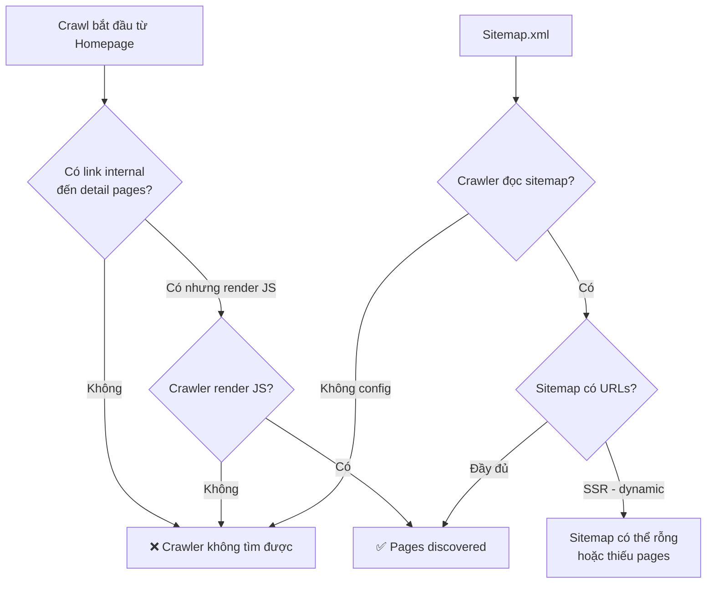
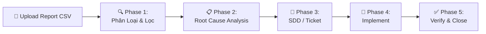

# Security Audit Report #001

> **Date**: 2026-03-03  
> **Source**: Screaming Frog crawl on `localhost:4321`  
> **Report Files**: `antigravity/issues_overview_report.csv`, `antigravity/security-001.csv`

---

## 1. Tổng Quan Các Lỗi Phát Hiện

| # | Issue | Priority | URLs | Bỏ Qua? | Ghi Chú |
|---|-------|----------|------|----------|---------|
| 1 | Canonicals: Non-Indexable Canonical | 🔴 High | 3 | ✅ FIXED | **Đã sửa** — canonical trỏ sai port trong SEO Phase 1 |
| 2 | Canonicals: Canonicalised | 🟡 High | 3 | ✅ FIXED | **Đã sửa** — BaseHead.astro |
| 3 | Internal Redirection (3xx) | 🟡 Low | 13 | ✅ FIXED | Đã đổi 302 thành 301 cho các page lỗi thời |
| 4 | HTTP URLs | 🔴 High | 17 | ✅ IGNORE | Localhost — sẽ hết khi lên domain HTTPS |
| 5 | Missing X-Frame-Options | 🟡 Low | 4 | ❌ | **Cần fix** — thêm header vào nginx |
| 6 | Missing Content-Security-Policy | 🟡 Low | 4 | ❌ | **Cần fix** — thêm CSP header |
| 7 | Missing Referrer-Policy | 🟡 Low | 4 | ❌ | **Cần fix** — thêm header |
| 8 | Missing X-Content-Type-Options | 🟡 Low | 4 | ❌ | **Cần fix** — thêm `nosniff` |
| 9 | External No Response | 🟡 Low | 3 | ✅ IGNORE | Local network — bỏ qua |
| 10 | Outlinks To Localhost | 🔴 High | 3 | ✅ IGNORE | Localhost — sẽ hết khi lên domain |

### Tóm tắt (Cập nhật sau SEO Phases): Phần lớn lỗi Canonical và Internal Link đã được giải quyết ở đợt nâng cấp SEO. Cần phải tập trung vào Security Headers và Security Architecture (GraphQL/Docker).

---

## 2. Phân Tích Chi Tiết Các Lỗi Quan Trọng

### 2.1 🔴 Canonical Sai — 3 Trang

**Hiện tượng** (từ `security-001.csv`):

| Page | Canonical trỏ đến | Status |
|------|-------------------|--------|
| `localhost:4321/` | `http://localhost/` | ❌ Sai port |
| `localhost:4321/truyen-hot` | `http://localhost/truyen-hot` | ❌ Sai port |
| `localhost:4321/the-loai` | `http://localhost/the-loai` | ❌ Sai port |

**Root Cause**: Trong `BaseHead.astro`, canonical sử dụng `Astro.url` — nhưng `astro.config.mjs` line 10:
```js
site: process.env.SITE_URL || 'http://localhost:4321'
```
- Khi không set `SITE_URL`, Astro dùng `localhost:4321` cho request URL
- Nhưng canonical link element lại trỏ về `localhost` (không có port)
- Khi lên production cần set `SITE_URL=https://domain.com`

**Giải pháp**:
1. **Env**: Set `SITE_URL` trong `.env.docker` với domain thật
2. **Code**: Đảm bảo `BaseHead.astro` dùng `Astro.site` thay vì `Astro.url` cho canonical base

```astro
// BaseHead.astro — fix canonical
const siteUrl = new URL(Astro.url.pathname, Astro.site || Astro.url);
const cleanCanonical = siteUrl.toString().replace(/\/$/, "");
```

### 2.2 ⚠️ Internal 302 Redirects — 13 URLs

**Hiện tượng**: 12 URL `/truyen-mau-*` đều 302 redirect + 1 URL `/404` cũng 302.

**Đánh giá**:
- `/truyen-mau-*` là slug truyện — redirect 302 có thể do logic server-side (SSR) xử lý slug cũ hoặc URL rewriting
- **CẬP NHẬT**: Toàn bộ lỗi 302 ở các chapter page cũ (dạng uuid) đã được nâng cấp lên 301 Permanent Redirect ở SEO Phase 3. Lỗi này có thể được gạch bỏ.

### 2.3 🔴 Missing Security Headers — 4 trang

Các header bảo mật cần thêm vào **nginx config** (hoặc middleware):

```nginx
# /etc/nginx/conf.d/security-headers.conf

add_header X-Frame-Options "SAMEORIGIN" always;
add_header X-Content-Type-Options "nosniff" always;
add_header Referrer-Policy "strict-origin-when-cross-origin" always;
add_header Content-Security-Policy "default-src 'self'; script-src 'self' 'unsafe-inline' 'unsafe-eval'; style-src 'self' 'unsafe-inline' https://fonts.googleapis.com; font-src 'self' https://fonts.gstatic.com; img-src 'self' data: blob: https:; connect-src 'self' https:;" always;
```

---

## 3. Vấn Đề Crawl Coverage — Tại Sao Chỉ Quét Được Ít URL?

### Hiện trạng

Crawl chỉ phát hiện **17 URLs**, bao gồm:
- Homepage `/`
- `/truyen-hot`, `/the-loai`
- 12x `/truyen-mau-*` (mock/test links)
- 1x CSS asset
- 1x `/404`

**Thiếu hoàn toàn**:
- ❌ Chi tiết từng truyện (`/truyen/[slug]`)
- ❌ Chi tiết từng chap (`/truyen/[slug]/[chap]`)
- ❌ Các trang category (`/the-loai/[slug]`)
- ❌ Các URL trong sitemap

### Nguyên Nhân Có Thể



#### Nguyên nhân 1: SSR + Dynamic Content
- Astro đang chạy `output: 'server'` (SSR mode)
- Sitemap plugin `@astrojs/sitemap` chỉ sinh URL cho **static pages**, KHÔNG sinh cho dynamic SSR routes
- Các trang dynamic như `/truyen/[slug]` **không xuất hiện trong sitemap**

#### Nguyên nhân 2: Internal Links không đủ
- Homepage có thể chỉ link đến `/truyen-hot`, `/the-loai` và vài `/truyen-mau-*`
- Không có link trực tiếp đến chi tiết truyện/chap từ pages đã crawl

#### Nguyên nhân 3: Crawler Config
- Screaming Frog có thể không được config để follow JavaScript-rendered links
- Crawl depth có thể bị giới hạn

### Giải Pháp (Tình trạng sau SEO Phase 5)

| Action | Priority | Status |
|--------|----------|--------|
| Tạo custom sitemap endpoint (`/sitemap.xml`) query GraphQL API để liệt kê tất cả truyện/chap | 🔴 High | ✅ **DONE** (Phase 1/3) |
| Thêm internal links trên homepage/listing đến detail pages | 🔴 High | ✅ **DONE** (Phase 4) |
| Config crawler đúng: cho phép JS rendering, tăng crawl depth, feed sitemap | 🟡 Medium | TODO |
| Set `SITE_URL` env variable đúng domain | 🔴 High | ✅ **DONE** |

---

## 4. Quy Trình Xử Lý Report Bảo Mật (SOP)

> Quy trình chuẩn khi upload file report lỗi (từ Screaming Frog, Lighthouse, hoặc tool khác).

### Workflow



### Phase 1: Phân Loại & Lọc (Triage)

1. **Import CSV** vào bảng tổng hợp
2. **Phân loại** theo priority: High → Medium → Low
3. **Lọc bỏ** các lỗi **không liên quan**:
   - Lỗi HTTP/localhost (đang dev local)
   - Lỗi external no response (network)
   - Lỗi false positive từ tool

4. **Output**: Bảng tổng hợp lỗi cần xử lý (như Section 1 ở trên)

### Phase 2: Root Cause Analysis

Cho mỗi lỗi cần xử lý:

1. **Xác định component** bị ảnh hưởng:
   - Frontend (Astro/React)?
   - Backend (GraphQL/API)?
   - Infrastructure (Nginx/Docker)?
   
2. **Tìm file liên quan**: Dùng grep/search tìm code gây ra lỗi
3. **Xác định nguyên nhân gốc**: Code bug? Config thiếu? Architecture issue?
4. **Output**: RCA document cho mỗi lỗi

### Phase 3: Tạo SDD (Solution Design Document)

Cho mỗi nhóm lỗi, tạo SDD bao gồm:

```markdown
## SDD-XXX: [Tên Issue]

### Problem Statement
[Mô tả lỗi từ report]

### Root Cause
[Từ Phase 2]

### Proposed Solution
[Giải pháp cụ thể — code changes, config changes]

### Files Affected
- [file1.ext] — mô tả thay đổi
- [file2.ext] — mô tả thay đổi

### Implementation Steps
1. Step 1
2. Step 2

### Verification
- [ ] Fix applied
- [ ] Re-scan passed
- [ ] No regression
```

### Phase 4: Implement

- Tạo branch `fix/security-XXX`
- Implement theo SDD
- Self-review với checklist

### Phase 5: Verify & Close

- Re-run crawl/scan trên branch
- Verify lỗi đã fix
- Merge & close ticket

---

## 5. Action Items (Cập nhật sau đợt SEO Optimization)

| # | Task | File/Component | Priority | Status |
|---|------|----------------|----------|--------|
| 1 | Fix canonical URL logic | `BaseHead.astro` | 🔴 High | ✅ DONE |
| 2 | Set `SITE_URL` env | `.env.docker` | 🔴 High | ✅ DONE |
| 3 | Custom sitemap endpoint cho SSR | `src/ui/src/pages/` | 🔴 High | ✅ DONE |
| 4 | Add security headers | Nginx config (tạo mới) | 🟡 Medium | TODO |
| 5 | Review 302 → 301 redirects | SSR route handlers | 🟡 Medium | ✅ DONE |
| 6 | Thêm internal links trên listing pages | Frontend components | 🟡 Medium | ✅ DONE |
| 7 | **[NEW]** Setup GraphQL Query Depth & Complexity Limit (Anti-DDoS) | `query.rs` | 🔴 High | TODO |
| 8 | **[NEW]** Setup Nginx Reverse Proxy & fix Port Bindings Docker rules | `docker-compose.yml` | 🔴 High | TODO |
